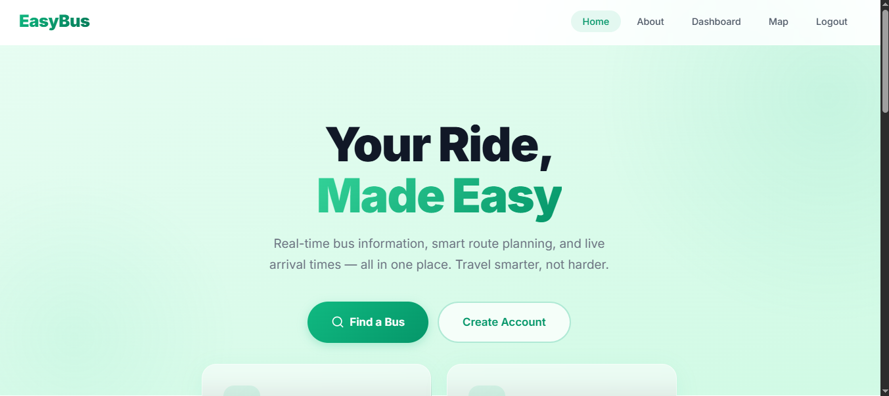
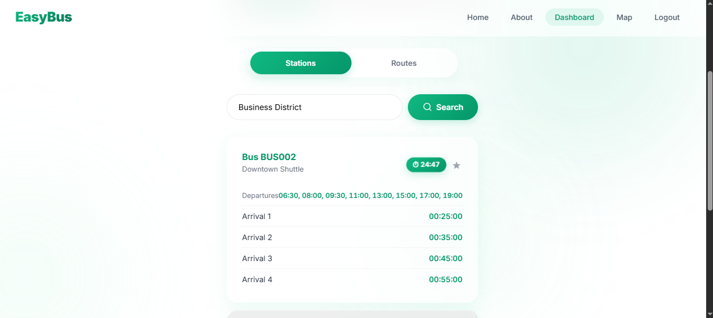
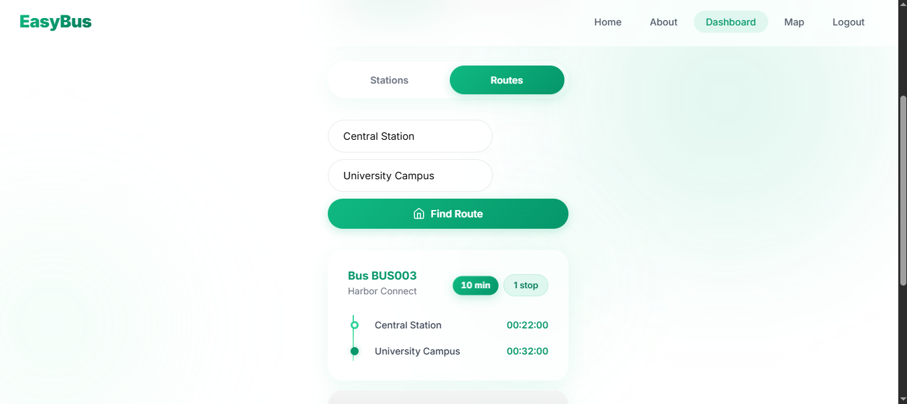
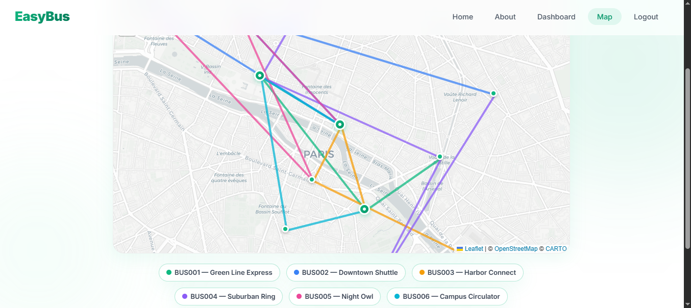

# EasyBus

## Team Members:

### Adam El Madani
Project Manager, Developer

### Bouzrbay Ghita
Designer, Developer

## Description:

EasyBus is a modern, responsive Web application designed to provide users with real-time information about nearby bus routes, timings, and stops. With a user-friendly interface powered by clean glassmorphism design, users can easily plan their trips, find the closest bus stops with an interactive map, and track the arrival times of buses seamlessly.

## Technologies Used:

+ **HTML5, Vanilla CSS, Vanilla JS** for the frontend user interface and interactions.
+ **Leaflet.js** for interactive map functionality and displaying bus routes and stops.
+ **Node.js with Express.js** for robust backend API routing and operations.
+ **JSON-based Local Storage** (`easybus_db.json`) for securely storing ad-hoc transit and routing data.

## Features:

+ **Interactive Map:** Track routes and stops directly from the built-in Leaflet-powered map.
+ **Real-time Tracking:** Predict and get accurate estimates of bus arrivals.
+ **User Management:** Create accounts and manage preferences securely.
+ **Responsive Interface:** Modern, glassmorphism UI adaptable to all device sizes.

## Schedule of Work:
We will use Trello to organize our tasks and track our progress. Here's our tentative schedule:

1. Project setup, database integration, and UI design.
2. Implementing real-time updates for bus timings, fetching and displaying bus routes, and stops.
3. Testing, bug fixes, and optimization.
4. Final testing, polishing UI, and deployment.

---

> **Note:**
> This repository is subject to further refinement and adjustments during the development process. We aim to deliver a high-quality and user-friendly web application. Thank you for considering EasyBus!
